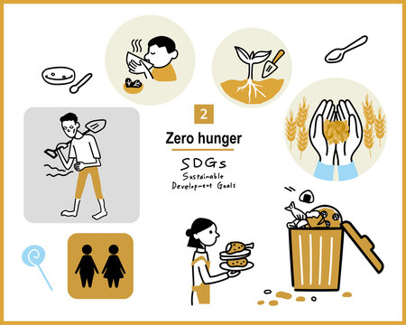
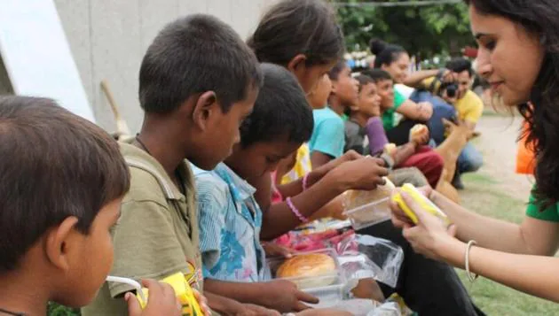

## Food For All

## **An initiative to make `Zero Hunger` possible**

### Zero Hunger: A Dream or an Unrealistic Goal?

The noble aspiration of achieving *Zero Hunger* by 2030, enshrined in Sustainable Development Goal 2, is facing increasing scrutiny. While the goal itself remains undeniably crucial, questions about its feasibility and potential unintended consequences have emerged. This essay will explore the complexities surrounding *Food for All*, examining the progress made, the challenges encountered, and the reasons why the goal might currently seem unsustainable.

### Progress and Challenges:

Since its inception, Goal 2 has witnessed significant achievements. Global hunger rates have declined, with the number of undernourished people decreasing from 1.2 billion in 1990 to 795 million in 2016. Improved agricultural practices, increased access to markets, and social safety nets have contributed to these positive trends.

However, the road ahead remains daunting. Over 820 million people still lack adequate food, and malnutrition plagues millions, particularly children and pregnant women. Furthermore, progress has stagnated in recent years, raising concerns about achieving the 2030 target.

### Our project emerging as a solution:

As a small initiative to make a bigger change in the world and the ecosystem, we have made our project *Food For All* which establishes a connection between the NGO owner and the donor and facilitates the donation of a good sum for the welfare of the impoverished section of the society, deprived of basic food and well-being. Its seamless payment portal and verification of the authencity of the NGOs by multiple scrutiny checks makes it one of the most efficient in serving its purpose.